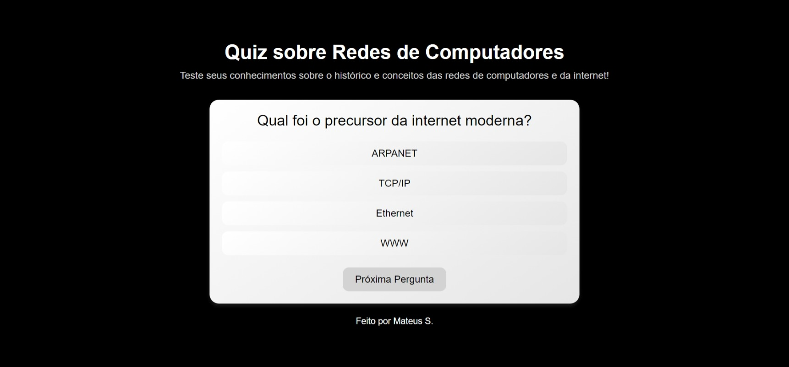
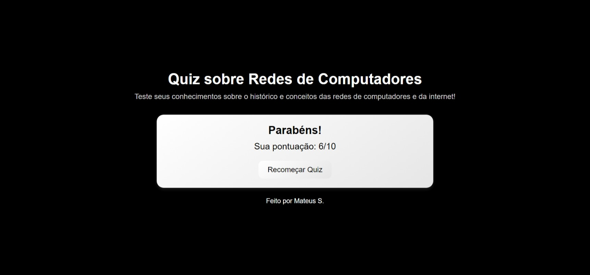

# Quiz sobre a História da Internet

Este repositório contém uma aplicação de quiz interativa que testa os conhecimentos sobre o histórico e os conceitos de redes de computadores e da internet. O objetivo é proporcionar uma maneira envolvente de aprender sobre a evolução da tecnologia das redes e os protocolos fundamentais que as sustentam.

## Justificativa da Importância

O conhecimento sobre redes de computadores e a internet é essencial nos dias de hoje, tanto para profissionais da área de TI quanto para o público em geral. Com o crescimento exponencial das tecnologias digitais e a constante evolução das infraestruturas de rede, entender os marcos históricos e os protocolos que sustentam as comunicações digitais é crucial.

Esta aplicação permite ao usuário testar e expandir seus conhecimentos de forma interativa, abordando conceitos como a ARPANET, protocolos de comunicação como TCP/IP e HTTP, e tecnologias que moldaram a internet como a conhecemos hoje. Ao fornecer uma experiência dinâmica com explicações detalhadas para cada resposta correta, o quiz contribui para uma compreensão mais profunda e acessível da história das redes de computadores.

## Imagens

*Acima está uma captura de tela do quiz em funcionamento.*

*Acima está uma captura de tela da pontuação do usuário no quiz.*

## Funcionalidades

A aplicação inclui as seguintes funcionalidades:

- **Perguntas Interativas**: O quiz possui uma série de perguntas sobre a história e os conceitos fundamentais das redes de computadores.
- **Feedback Imediato**: Ao selecionar uma resposta, o usuário recebe feedback imediato com a explicação da resposta correta, promovendo aprendizado contínuo.
- **Pontuação e Resultados**: O usuário pode acompanhar sua pontuação ao longo do quiz e ver um resultado final no final de todas as perguntas.
- **Reinício do Quiz**: O usuário pode reiniciar o quiz a qualquer momento para testar seus conhecimentos novamente e melhorar a pontuação.
- **Design Responsivo**: A interface foi projetada para ser amigável e adaptável, proporcionando uma experiência agradável tanto em desktops quanto dispositivos móveis.

## Tecnologias Utilizadas

A aplicação foi desenvolvida utilizando as seguintes tecnologias:

- **HTML5**: Para estruturar a página e exibir o conteúdo do quiz.
- **CSS3**: Para o design e estilo da página, com foco em uma experiência visual agradável e moderna.
- **JavaScript**: Para adicionar interatividade à aplicação, como navegação entre perguntas, validação de respostas e exibição de feedbacks.

## Contribuições

Contribuições são bem-vindas! Se você quiser sugerir melhorias ou adicionar novas funcionalidades, fique à vontade para abrir uma issue ou fazer um pull request.

## Créditos

Desenvolvido por Mateus S.  
GitHub: [Matz-Turing](https://github.com/Matz-Turing)
